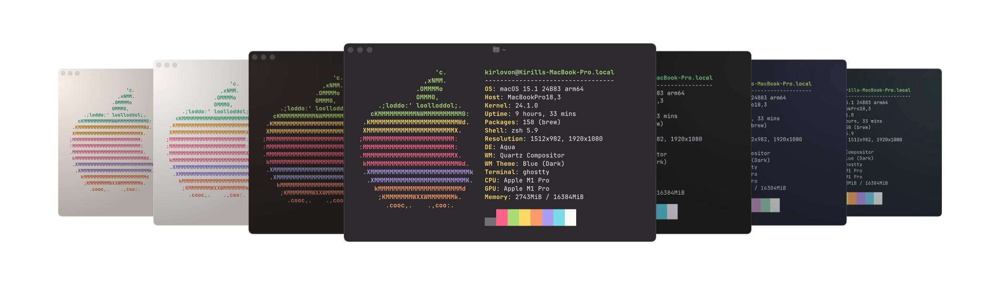

# Monokai Pro for Ghostty 👻

Monokai Pro theme for [Ghostty](https://github.com/mitchellh/ghostty) terminal. Generated from the original iTerm2 color schemes, made by [Monokai](https://monokai.com/) .

<br>

| Theme                          | File Path                         |
| ------------------------------ | --------------------------------- |
| Monokai Classic                | [Link](Monokai%20Classic)         |
| Monokai Pro                    | [Link](Monokai%20Pro)             |
| Monokai Pro (Filter Octagon)   | [Link](Monokai%20Pro%20Octagon)   |
| Monokai Pro (Filter Machine)   | [Link](Monokai%20Pro%20Machine)   |
| Monokai Pro (Filter Ristretto) | [Link](Monokai%20Pro%20Ristretto) |
| Monokai Pro (Filter Spectrum)  | [Link](Monokai%20Pro%20Spectrum)  |
| Monokai Pro Light              | [Link](Monokai%20Pro%20Light)     |
| Monokai Pro Light (Filter Sun) | [Link](Monokai%20Pro%20Sun)       |

<br>

## Installation

1. Download the desired theme file
2. Add the following to your `~/.config/ghostty/config`:

> For easy installation, you can copy content of the theme file and paste it directly into the `~/.config/ghostty/config` file.

<br>

## Building from Source

Requirements:

-   [Deno](https://deno.land/) runtime

```bash
# Clone the repository
git clone https://github.com/yourusername/monokai-ghostty
cd monokai-ghostty

# Run the generation script
deno run --allow-read --allow-write generate.ts
```

<br>

## Credits

These color schemes are based on [Monokai Pro](https://monokai.pro/iterm) by Monokai. The original color schemes are property of Monokai and were converted from their iTerm2 format.

<br>

## License

The color schemes are property of Monokai. The conversion script is MIT licensed.
