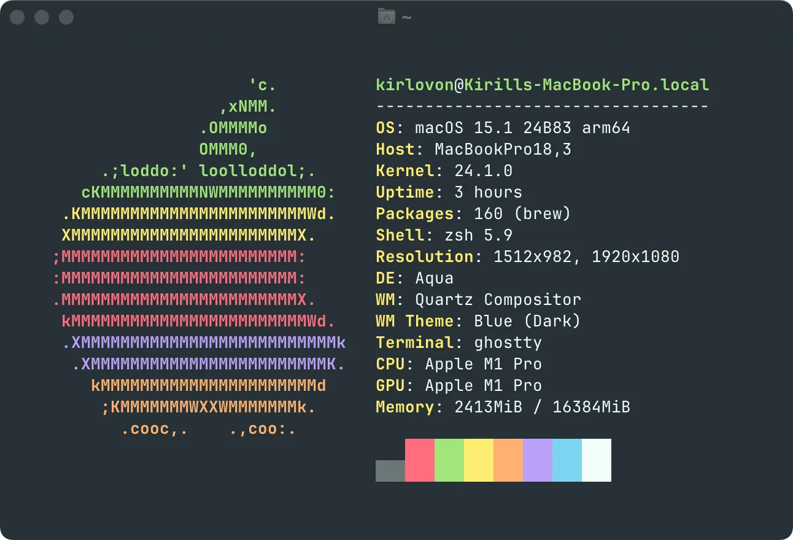

> [!TIP]
> Themes from this repository are also included in [iTerm2-Colour-Schemes](https://github.com/mbadolato/iTerm2-Color-Schemes). Ghostty automatically fetches themes from there, so you don’t need to download anything. Just specify a theme name in your config!
> ```ini
> theme = "Monokai Pro" # Or "Monokai Pro Spectrum", "Monokai Pro Light", etc
> ```

<br>


# Monokai for Ghostty 👻

Monokai themes for [Ghostty](https://github.com/mitchellh/ghostty) terminal. Generated from the official [Monokai Pro](https://monokai.pro/) color schemes for iTerm2, made by [Monokai](https://monokai.com/).

<br>

| Theme                                                                          | Preview                                          |
| ------------------------------------------------------------------------------ | ------------------------------------------------ |
| **Monokai Pro** <br> [Link to config](./Monokai%20Pro)                         |          |
| **Monokai Classic** <br> [Link to config](./Monokai%20Classic)                 |  |
| **Monokai Pro Octagon** <br> [Link to config](./Monokai%20Pro%20Octagon)       |       |
| **Monokai Pro Machine** <br> [Link to config](./Monokai%20Pro%20Machine)       |       |
| **Monokai Pro Ristretto** <br> [Link to config](./Monokai%20Pro%20Ristretto)   |   |
| **Monokai Pro Spectrum** <br> [Link to config](./Monokai%20Pro%20Spectrum)     |     |
| **Monokai Pro Light** <br> [Link to config](./Monokai%20Pro%20Light)           |           |
| **Monokai Pro Light Sun** <br> [Link to config](./Monokai%20Pro%20Light%20Sun) |          |

<br>

## Manual Installation

1. Download the [archive with themes](https://github.com/Kirlovon/monokai-ghostty/releases).

2. Extract theme files to the themes folder:

    - **MacOS:** `~/.config/ghostty/themes`.
    - **Linux (XDG):** `$XDG_CONFIG_DIR/ghostty/themes`.

3. Set the theme in your config file:
    ```ini
    theme = "Monokai Pro" # Or "Monokai Pro Spectrum", "Monokai Pro Light", etc
    ```

<br>

## Building from Source

1. Make sure you have [Deno](https://deno.land/) _(at least v2.0)_ installed.

2. Copy the original `.itermcolors` theme files to the `itermcolors` folder in the repo directory. You can get them from the official [Monokai Pro](https://monokai.pro/iterm) website.

3. Run the generation script:

    ```bash
    deno run --allow-read --allow-write generate.ts
    ```

<br>

## License

> These themes are based on the original [Monokai Pro](https://monokai.pro/iterm) iTerm2 color schemes by [Monokai](https://monokai.com/). All rights to the original color schemes and the **Monokai Pro** trademark belong to the original author.

The code and generated configurations are licensed under the MIT License _(see [LICENSE](./LICENSE) file)_
