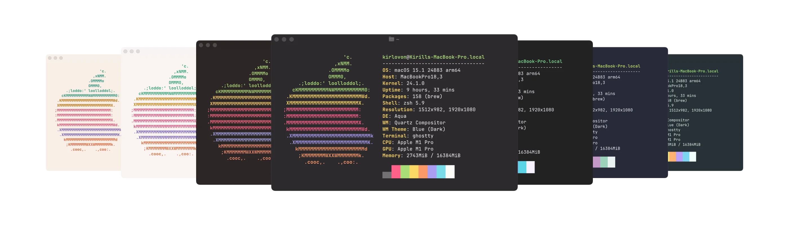

# Monokai for Ghostty 👻

Monokai themes for [Ghostty](https://github.com/mitchellh/ghostty) terminal. Generated from the official iTerm2 color schemes, made by [Monokai](https://monokai.com/).

<br>

> For quick installation, just put the content of the theme file into your terminal config. For regular installation, follow the [instruction](#installation) below.

| Theme                                                                               | Preview                                          |
| ----------------------------------------------------------------------------------- | ------------------------------------------------ |
| **Monokai Pro** <br> [Link to file](./Monokai%20Pro)                                |          |
| **Monokai Classic** <br> [Link to file](./Monokai%20Classic)                        |  |
| **Monokai Pro (Filter Octagon)** <br> [Link to file](./Monokai%20Pro%20Octagon)     |       |
| **Monokai Pro (Filter Machine)** <br> [Link to file](./Monokai%20Pro%20Machine)     |       |
| **Monokai Pro (Filter Ristretto)** <br> [Link to file](./Monokai%20Pro%20Ristretto) |   |
| **Monokai Pro (Filter Spectrum)** <br> [Link to file](./Monokai%20Pro%20Spectrum)   |     |
| **Monokai Pro Light** <br> [Link to file](./Monokai%20Pro%20Light)                  |           |
| **Monokai Pro Light (Filter Sun)** <br> [Link to file](./Monokai%20Pro%20Sun)       |          |

<br>

## Installation

1. Download archive wih themes from the [releases page]().

2. Extract theme files to the themes folder:

    - **MacOS:** `~/.config/ghostty/themes`.
    - **Linux (XDG):** `$XDG_CONFIG_DIR/ghostty/themes`.

3. Set the theme in your config file:
    ```ini
    theme = "Monokai Pro" # Or "Monokai Pro Spectrum", "Monokai Pro Light", etc
    ```

<br>

## Building from Source

1. Make sure you have [Deno](https://deno.land/) installed.

2. Copy the original `.itermcolors` theme files to the `itermcolors` folder in the repo directory. You can get them from the [Monokai Pro](https://monokai.pro/iterm) website.

3. Run the generation script:

    ```bash
    deno run --allow-read --allow-write generate.ts
    ```

<br>

## License

> These color schemes were converted from the original iTerm2 color schemes by [Monokai Pro](https://monokai.pro/iterm). All rights to the original color schemes and the **Monokai Pro** trademark are owned by Monokai.

Code and generated configs under MIT License _(see [LICENSE](./LICENSE) file)_
